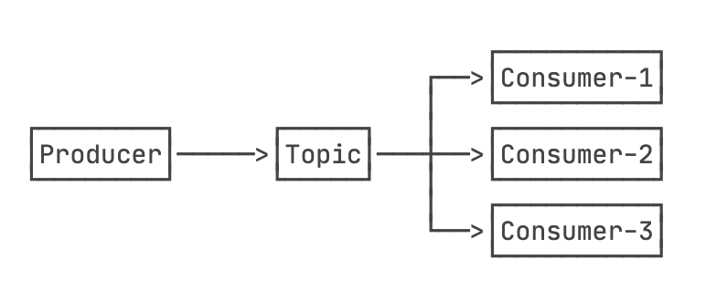
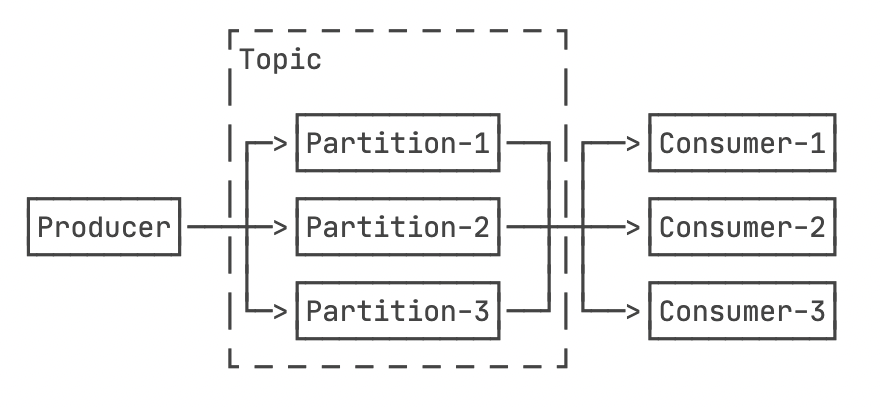

# Kafka学习路线

哈哈，其实主要是在各种博客上面摘抄～

Kafka 是一种分布式的，基于发布 / 订阅的消息系统。主要设计目标如下：

- 以时间复杂度为 O(1) 的方式提供消息持久化能力，即使对 TB 级以上数据也能保证常数时间复杂度的访问性能。
- 高吞吐率。即使在非常廉价的商用机器上也能做到单机支持每秒 100K 条以上消息的传输。
- 支持 Kafka Server 间的消息分区，及分布式消费，同时保证每个 Partition 内的消息顺序传输。
- 同时支持离线数据处理和实时数据处理。
- Scale out：支持在线水平扩展。

## MQ(message queue)

### “发布-订阅”模式

发布订阅模式是指订阅者（Subscriber）通过一个主题（Theme）和自定义事件（Event）进行消息订阅，当发布者（Publisher）通过发布主题的方式通知各个订阅该主题的Subscriber执行绑定的回调事件。

**优点：**

- 降低各个模块之间的耦合度，模块之间是松散耦合的。
- 更加灵活，多个订阅者订阅同一个主题，但各个订阅者之间并不知道对方的存在，互不影响，只要发布者发布了主题之后，订阅者就各自执行自己的回调。

在学习kafka之前，我想我还是先学学JMS吧

## JMS

在JMS API出现之前，大部分产品使用“点对点”和“发布/订阅”中的任一方式来进行消息通讯。JMS定义了这两种消息发送模型的规范，它们相互独立。任何JMS的提供者可以实现其中的一种或两种模型，这是它们自己的选择。JMS规范提供了通用接口保证我们基于JMS API编写的程序适用于任何一种模型。

在J2EE中，当两个应用程序使用JMS进行通信时，它们之间并不是直接相连的，而是通过一个共同的消息收发服务连接起来，可以达到解耦的效果。

### 点对点消息传送模型

　　在点对点消息传送模型中，应用程序由消息队列，发送者，接收者组成。每一个消息发送给一个特殊的消息队列，该队列保存了所有发送给它的消息(除了被接收者消费掉的和过期的消息)。点对点消息模型有一些特性，如下：

- 每个消息只有一个接收者；
- 消息发送者和接收者并没有时间依赖性；
- 当消息发送者发送消息的时候，无论接收者程序在不在运行，都能获取到消息；
- 当接收者收到消息的时候，会发送确认收到通知（acknowledgement）。

### 发布/订阅消息传递模型

　　在发布/订阅消息模型中，发布者发布一个消息，该消息通过topic传递给所有的客户端。在这种模型中，发布者和订阅者彼此不知道对方，是匿名的且可以动态发布和订阅topic。topic主要用于保存和传递消息，且会一直保存消息直到消息被传递给客户端。

发布/订阅消息模型特性如下：

- 一个消息可以传递给多个订阅者
- 发布者和订阅者有时间依赖性，只有当客户端创建订阅后才能接受消息，且订阅者需一直保持活动状态以接收消息。
- 为了缓和这样严格的时间相关性，JMS允许订阅者创建一个**可持久化的订阅**。这样，即使订阅者没有被激活（运行），它也能接收到发布者的消息。

### 接收消息

　　在JMS中，消息的接收可以使用以下两种方式：

####   同步

　　使用同步方式接收消息的话，消息订阅者调用receive()方法。在receive()中，消息未到达或在到达指定时间之前，方法会阻塞，直到消息可用。

####   异步

　　使用异步方式接收消息的话，消息订阅者需注册一个**消息监听者**，类似于事件监听器，只要消息到达，JMS服务提供者会通过调用监听器的**onMessage()**递送消息。

### 未完待续。。。

## Kafka相关术语介绍

- **Broker**

  Kafka集群包含一个或多个服务器，这种服务器被称为broker 

- **Topic**

  每条发布到Kafka集群的消息都有一个类别，这个类别被称为Topic。（物理上不同Topic的消息分开存储，逻辑上一个Topic的消息虽然保存于一个或多个broker上但用户只需指定消息的Topic即可生产或消费数据而不必关心数据存于何处）

- **Partition**

  Partition是物理上的概念，每个Topic包含一个或多个Partition.

- **Producer**

  负责发布消息到Kafka broker

- **Consumer**

  消息消费者，向Kafka broker读取消息的客户端。

- **Consumer Group**

  每个Consumer属于一个特定的Consumer Group（可为每个Consumer指定group name，若不指定group name则属于默认的group）。
  
   

Kafka如何支持十万甚至百万的并发呢？答案是分区。Kafka的一个Topic可以有一个至多个Partition，并且可以分布到多台机器上：

