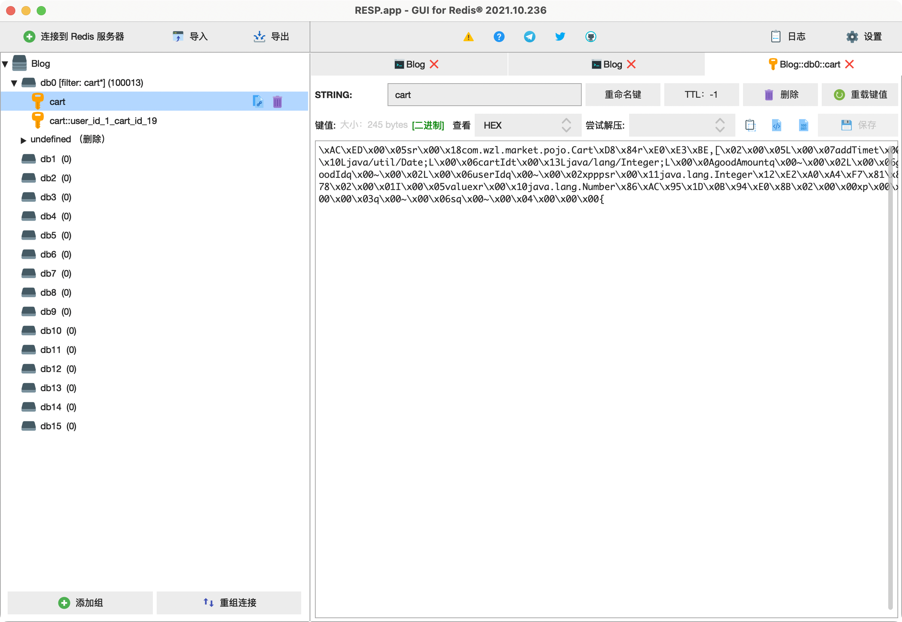
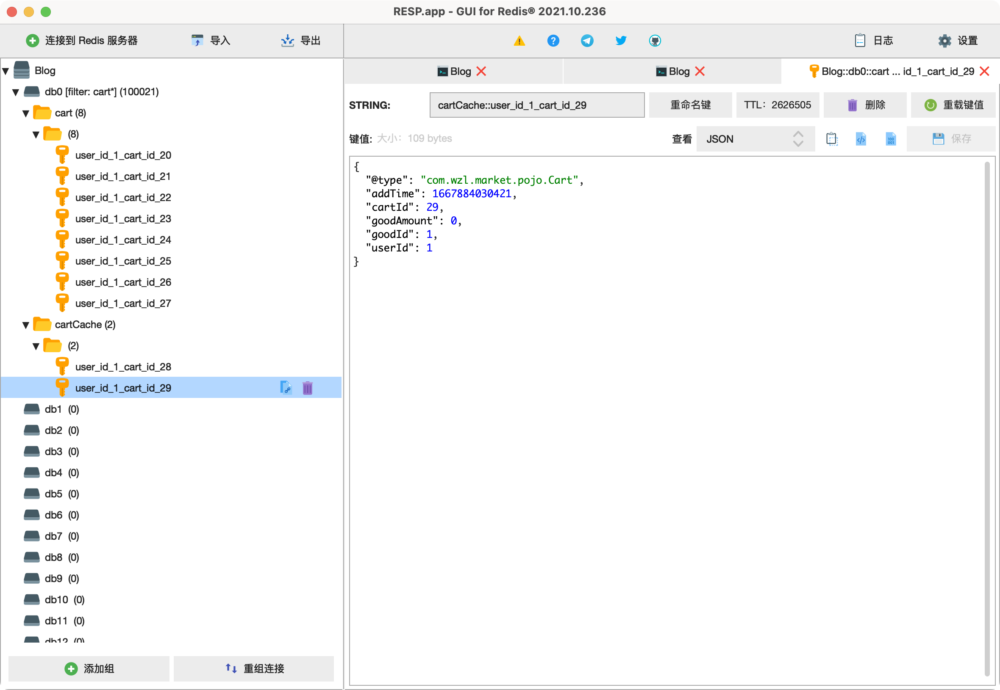
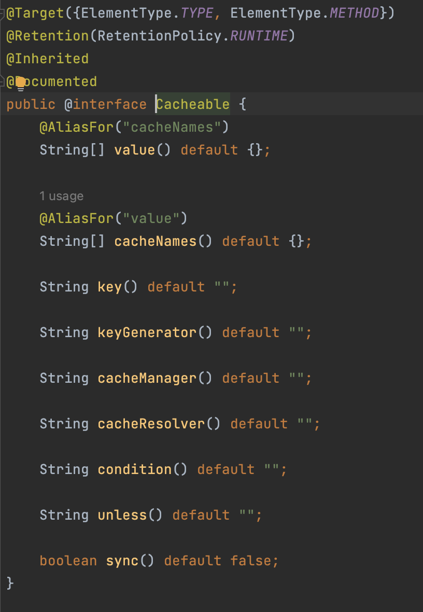
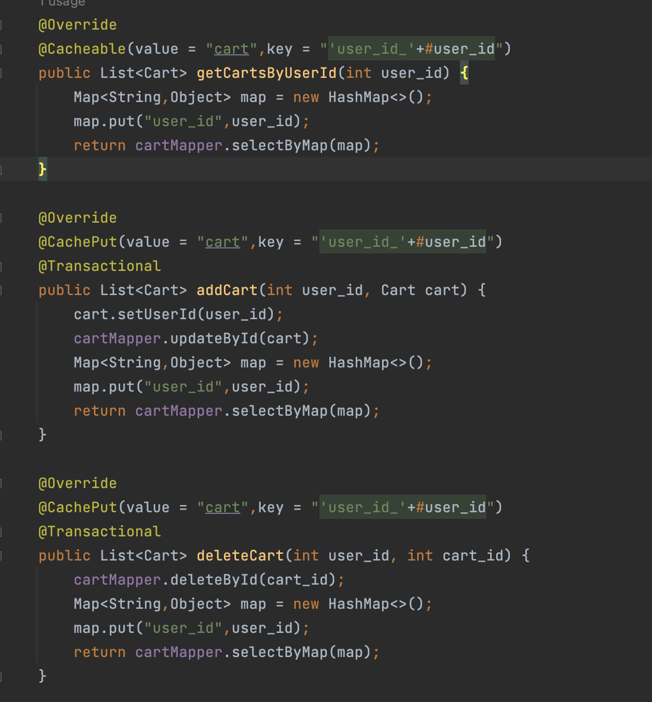
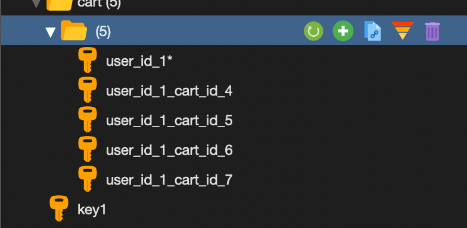

# SpringCache+Redis+Serializer

[TOC]

## 起因

学习这个Spring自带的缓存功能的起因是项目需要做一个购物车的功能，本来也没想那么多，设计好了数据表就没管他了，但是后面觉得购物车也算是一个高并发的功能，所以对其进行了查表情况分析如下：

> 1. 查找与用户ID相关的所有记录
> 2. 新增一条记录
> 3. 删除一条记录
> 4. 修改一条记录，如增加要购买的商品的数量。
> 5. 查找该记录需要花费多少钱。

就发现无论进行了什么需求，都要执行操作1，这对数据库的压力其实蛮大的，因为用户ID并不是一条索引，查询时压力大。

所以自然而然的就想到了使用缓存来做这个功能，也是本着巩固自己redis知识的目的。然后在思考的过程中突然想到了之前看过的书里面有关于spring自己的缓存的介绍。就打算用SpringCache这个算是框架吧，来集成redis做购物车功能。

## SpringCache

和数据库事务一样，Spring提供了缓存的管理器和相关的注解来支持类似于Redis这样的键值对缓存。

### 配置类

在springboot中，主要是通过配置一个`CacheManager`来实现对缓存的管理和操作，我们可以自定义对缓存的配置，比如说对key和value的序列化工具，还有定义缓存持续时间。

```java
@Bean
@SuppressWarnings(value = { "unchecked", "rawtypes" })
public CacheManager cacheManager(RedisConnectionFactory redisConnectionFactory) {
    // 生成一个默认配置，通过config对象即可对缓存进行自定义配置
    RedisSerializer<String> redisSerializer = new StringRedisSerializer();
    // 使用FastJsonRedisSerializer来序列化和反序列化redis的value值
    FastJsonRedisSerializer serializer = new FastJsonRedisSerializer(Object.class);
    // 配置序列化
    RedisCacheConfiguration config = RedisCacheConfiguration.defaultCacheConfig().serializeKeysWith(RedisSerializationContext.SerializationPair.fromSerializer(new StringRedisSerializer()))
         .serializeValuesWith(RedisSerializationContext
   .SerializationPair.fromSerializer(new FastJsonRedisSerializer(Object.class)))
            .entryTtl(Duration.ofSeconds(2626520))
            .disableCachingNullValues();
    Set<String> cacheNames = new HashSet<>();
    cacheNames.add("cartCache");
    return  RedisCacheManager.builder(redisConnectionFactory).cacheDefaults(config).initialCacheNames(cacheNames).build();
}
```

### 需要注意的坑点

在自己开发的过程中，踩了好多坑，真是十分折磨人，想起来还是一把眼泪。

- 首先一个坑就是在返回对象的时候，必须要先进行`cacheDefaults(config)`的配置，否则如果先进行了`initialCacheNames(cacheNames)`方法的话，会导致管理那块cache区域的manager的配置加载了默认的配置，生成了`DefaultManager`，我们做的配置就白配置了。CSDN很多坑人的博客不仅不强调这一点，甚至还有叫人先配置initialCacheNames(cacheNames)的，太坑了。
- 然后一个最坑的，坑了我大半天的点，就是这个`RedisCacheConfiguration`类的配置是链式进行的，这个太坑了，在绝望的时候终于翻到一个没什么浏览量的博客，讲到了这一点。这个类里面每一个配置方法都是返回进行了配置过的对象，所以要在这个对象的基础上再调用方法进行配置。我之前是一行写一个配置类，搞了半天，自定义的序列化却一直不生效，迟迟找不到原因。

### RedisCache存储的数据结构

SpringCache的功能有限，因为RedisCacheManager只支持**字符串类型的普通K-V键值对**，不支持其它四种数据结构，这就让我很蛋疼，因为购物车的数据分层大概是`用户----购物车信息唯一ID----购物车记录信息`，这样的话使用Hash数据结构是最合适的，但很可惜并不行，所以只能从键名上面下手了。

### 序列化

之前一直没有对序列化有什么了解过，序列化util代码也基本上都是copy来的，这次踩坑让我一度以为是自己的序列化方式不对，正好给了自己一个好好学习几种序列化方式的机会。

- **序列化：将对象写入到IO流中**
- **反序列化：从IO流中恢复对象**
- **意义：序列化机制允许将实现序列化的Java对象转换位字节序列，这些字节序列可以保存在磁盘上，或通过网络传输，以达到以后恢复成原来的对象。序列化机制使得对象可以脱离程序的运行而独立存在。**
- **使用场景：所有可在网络上传输的对象都必须是可序列化的**，**所有需要保存到磁盘的java对象都必须是可序列化的。通常建议：程序创建的每个JavaBean类都实现Serializeable接口。**

### RedisTemplate及几种序列化方式

使用Spring 提供的 Spring Data Redis 操作redis 必然要使用Spring提供的模板类 RedisTemplate。

在`RedisTemplate`类中，定义了这样四个变量：

```java
@Nullable
private RedisSerializer keySerializer = null;
@Nullable
private RedisSerializer valueSerializer = null;
@Nullable
private RedisSerializer hashKeySerializer = null;
@Nullable
private RedisSerializer hashValueSerializer = null;
```

在默认情况下，`RedisTemplate`使用的默认序列化策略是`JdkSerializationRedisSerializer`。

#### String序列化方式

`RedisTemplate<K, V>` 支持泛型，而我经常听到的`StringRedisTemplate` K V 均为String类型。StringRedisTemplate 继承 RedisTemplate 类，使用 **StringRedisSerializer** 字符串序列化方式。这种序列化方式一般用来进行key值的序列化和反序列化，因为key值基本上都是String类型的。如果要使用在value上的话，则需要我们实现`RedisSerializer<T>`接口，那实际上就已经不是使用String序列化方式了，因为**StringRedisSerializer**本身就是一个实现了`RedisSerializer<T>`接口的类。

```java
public String deserialize(@Nullable byte[] bytes) {
    return bytes == null ? null : new String(bytes, this.charset);
}

public byte[] serialize(@Nullable String string) {
    return string == null ? null : string.getBytes(this.charset);
}
```

可以看到，`StringRedisSerializer`采用的是字符串和对应编码下二进制数组之间的转换。

在这种编码格式下，如果我们向redis保存信息，然后用客户端访问Redis时，只要编码格式一致，就能看到保存信息的原文。保存字符串ABC，客户端看到的也是字符串ABC。

#### Jdk序列方式

与StringRedisSerializer一样实现了`RedisSerializer<T>`接口的序列化类还有一个`JdkSerializationRedisSerializer`要使用这个序列化方法，实体类需要实现Serializable接口。我并不是很喜欢这个序列方式，因为这样在redis客户端里面看到的就只是一堆无意义的二进制字符



#### Json序列化方式

这是我最后使用的方式，一般有两种实现方法，一是用国内阿里巴巴的FastJson来做，还有就是用国外的Jackson来做，这两种的差别并不是很明显，都能用，fastjson的速度要快不少，但是jackson的扩展功能更多。就按自己需求使用就好了，我是使用了fastjson，首先要自己实现RedisSerializer<T>接口，用fastjson里面提供的parse方法来实现序列化和反序列化两个方法。

```java
public class FastJsonRedisSerializer<T> implements RedisSerializer<T> {
    public static final Charset DEFAULT_CHARSET = StandardCharsets.UTF_8;

    private Class<T> clazz;

    static{ParserConfig.getGlobalInstance().setAutoTypeSupport(true);}

    public FastJsonRedisSerializer(Class<T> clazz){
        super();
        this.clazz = clazz;
    }

    @Override
    public byte[] serialize(T t) throws SerializationException{
        if (t == null){
            return new byte[0];
        }
        //System.out.println(JSON.toJSONString(t, SerializerFeature.WriteClassName));这是我用来判断Cache有没有走这个序列化方式的办法。
        return JSON.toJSONString(t, SerializerFeature.WriteClassName).getBytes(DEFAULT_CHARSET);
    }

    @Override
    public T deserialize(byte[] bytes) throws SerializationException{
        if (bytes == null || bytes.length <= 0){
            return null;
        }
        String str = new String(bytes, DEFAULT_CHARSET);
        return JSON.parseObject(str, clazz);
    }
    protected JavaType getJavaType(Class<?> clazz){
        return TypeFactory.defaultInstance().constructType(clazz);
    }
}
```

这样只要在需要使用的时候new一个对象出来就可以使用fastJson的序列化工具了。但是我在想，在将一个对象序列化成一个字符串，怎么保证字符串反序列化成对象的类型呢？



其实看看序列化完之后的结果就知道了，无论是哪种Json序列化器，都会在字符串多冗余一个类型，用来表示这个Json字段原来的类型是什么。Jackson里面是 @class ：xxx 的键值对，fastJson里面则是 @type ： xxx。只能说大同小异了。

### 通过标签实现缓存

虽然spring这个缓存这不支持，那不支持的，但还是有他过人之处的。它提供了几个基于AOP原理的标签供人使用，不仅直观，并且很重要的是极大的减小了程序代码的耦合度。

比如说我要做一个逻辑，先查询Redis中是否有数据，有的话就返回Redis中的数据，没有的话从数据库中查询，并且存入Redis。这个过程需要使用redisTemplate对redis客户端进行操作，并且逻辑分层较多。不利于代码维护和复用，耦合度很高。SpringCache就通过标签注解的形式加上AOP的编程思维，帮我们降低了开发难度和耦合度，并且还可以自由切换缓存组件，并非一定使用Redis。

#### @Cacheable

这个标签实际上就直接实现了上述的逻辑功能。



一般用到的就是`value`和`key`。value就是指缓存区，实际上在Redis里面就只是键的前缀，和key形成Redis里面的KEY，格式为`value::key`，这边为啥是两个冒号我不是很清楚，应该还是有其他什么用处的，但我是不清楚了。

关于Key的字符串支持强大的springEL表达式，可以动态拼接字符串，获取参数或者返回值甚至方法的名字。Cache还支持一个keyGenerater来自定义key的生成策略，比如说可以通过方法名字还有参数生成唯一的RedisKey。

```java
@CachePut(value = "cartCache",key = "'user_id_'+#user_id+'_cart_id_'+#result.cartId")
```

这个标签一般用于查询之类的方法，规范上是作用于service层。

#### @CachePut

这个标签和上一个标签不同，这个是必定先进行方法，然后才把数据存进Redis，具体是通过返回值实现的，会把返回值存到value和key指向的空间。

一般用于更改数据的时候。

#### @CacheEvict

这个标签主要就是释放缓存的作用，删除value和key指向的RedisKey，可惜不支持模糊匹配。

## 购物车功能思考

到这里差不多也把SpringCache的基本知识疏通了一遍，也大概写了一下代码，感觉并不是很好。



这个写法的话，就是不考虑细分购物车记录了，一个用户一个键值对，值为整个List，这样的缺陷很明显，在新增一条记录和删除一条记录的时候，都需要查数据库获得最新的list，多了一步查询过程，很明显这个缓存并不理想。

但是也没有办法，SpringCache不支持Hash数据结构，这是没办法的。而value并不支持springEL表达式，没办法生成对于用户唯一的值，所只能在key值上面做文章了。

比如说在user_id后面再加一条cart_id，这种方法可行，但又没有完全可行，对于存储和删除来说是没问题，但是用在查上面就不好办了，首先cache是不支持模糊匹配的，我尝试过把key写成user_id_*的形式，但结果很拉垮



形成了一条新的key，不过确实想想也不可能实现，Cache没有这么智能......

问题不大，这个查询的功能就我自己来写就是了，虽然你SpringCache不支持模糊匹配，但是RedisTemplate还是支持的。

一次性获得多条键值对的方法有keys（getall）、scan两类，我有实际开发经验的舅舅告诉我说keys方法会锁住整个数据库，阻塞线程，可能导致服务器卡顿，所以要选择线程安全的scan。

因为RedisTemplate只支持对Hash、Set、ZSet数据结构针对数据键的scan，默认没有提供遍历数据库键（字符串类型）的scan，所以只能自己手写一个了，大概思路就是让游标探完整个数据库，把能匹配上的键存到Set里面，因为scan可能会探到重复的键，而Set又正好保证了数据的唯一性。

```java
public Set<String> scan(String matchKey) {
        Set<String> keys = (Set<String>) redisTemplate.execute((RedisCallback<Set<String>>) connection -> {
            Set<String> keysTmp = new HashSet<>();
            Cursor<byte[]> cursor = connection.scan(KeyScanOptions.scanOptions().match("*" + matchKey + "*").count(1000).build());
            while (cursor.hasNext()) {
                keysTmp.add(new String(cursor.next()));
            }
            cursor.close();
            return keysTmp;
        });
        return keys;
    }
```

然后简单的按key找value形成list返回就行了。

测试了之后效果还是可以的。

### 反思

但是看了看代码，因为并不是全部都用的Cache存储，实际上代码的耦合度并不低。我认为其实这个购物车并不需要使用这个缓存框架来实现。

回看这个框架的历史，从支持多种数据结构到只支持基础的K-V对，其实可以看出这个缓存的真正目的是为相对静态的数据服务的，就是基本不会根据查询条件而导致结果多样化的数据，并且命中率高，比如适合做分类标签的查取。对于购物车功能，我还是直接使用Redis来做，或者使用有丰富查询API的mongoDB吧。

学习的过程前前后后整整花了我一整天的时间，虽然也没有开发出什么优秀的代码，但过程中还是收获很多的，这样的学习过程最熬人，但是对我的帮助其实蛮大的。