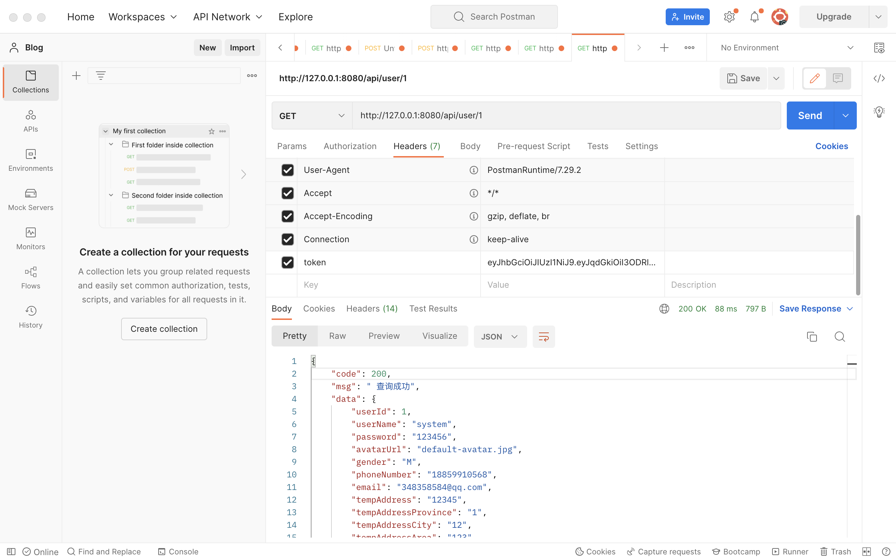
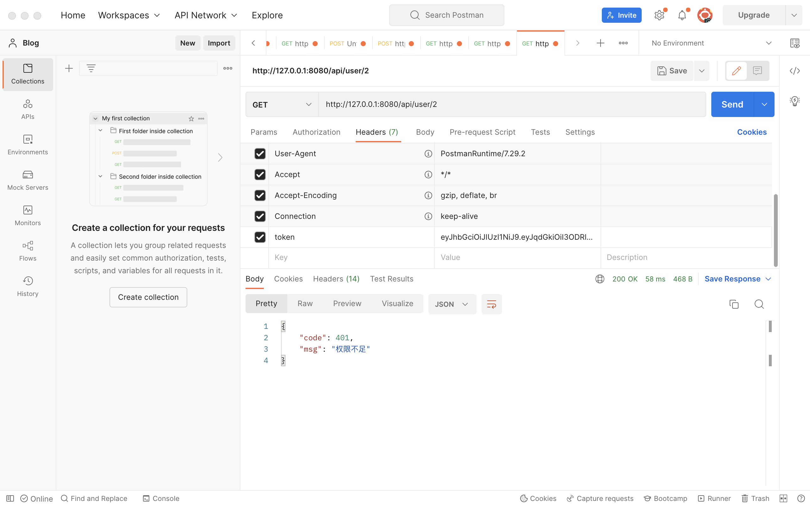

# SpringBoot 使用AOP拦截REST请求URL，进行权限验证。

-----------

[TOC]

## 背景引入

虽然spring security框架已经提供了很好用的权限验证类注解，如`@PreAuthorize`等，但我在实际开发中还是遇到了一些问题，对于同级权限的不同个体，其实还是需要做细分的权限设计的，这其实涉及到一个概念——**粗粒度和细粒度的权限管理**。

### 细粒度的权限管理

> 粗粒度和细粒度例子：
> 系统中有一个用户查询页面，对用户列表查询分权限，如粗粒度管理，张三和李四都有用户列表查询的权限，张三和李四都可以访问用户列表查询。
> 进一步进行细粒度的管理，张三(行政部)和李四(开发部)只可以查询自己本部门的用户信息，张三只能查看行政部的用户信息，李四只能查询开发部门的用户信息。细粒度的权限管理就是数据级别的权限管理。

因为在我的项目中涉及到了用户的定位信息，所以必须做细粒度的权限管理，即用户001不能查看用户002的全部个人信息，也不能更新用户002的个人信息。当然前提是用户001是一个会用表单提交自己的请求的坏孩子，如果所有用户都不会这样，那也没必要做这么深入的权限管理了。

实际上SpringSecurity是对细粒度的权限控制有支持的，比如`@access（）`这个标签就可以通过springEL表达式来判断，但是对于我的项目，这种权限上的管理常常是要查数据库获取对应信息的。对于正则表达式来说可能会很复杂，而且最重要的是我的正则表达式并不是很理想......

### 使用内存OR数据库？

不过我也有想过能不能在用户登录的时候提前做好这些数据的查询，毕竟用户登录认证过的ID就是从SpringSecurity的一个安全容器里面拿出来的，容器如图：

 

Authentication所指的里面有三个对象，其中principal肯定不陌生，在Security里面这个principal就是用户在登录认证成功之后，根据我们自己实现`UserDetails`接口的实体类，这个类我们是可以直接操作的，比如说给用户增加几个集合类似于 storeList，goodList，orderList这样的东西，我们要用的时候很轻松就能拿出来，如图

```java
LoginUser loginUser =  (LoginUser)SecurityContextHolder.getContext().getAuthentication().getPrincipal();
int login_id = loginUser.getUser().getUserId();
```

配合上AOP面向切面编程，想想我的口水都要流下来了！于是我去问了问我的程序员大佬舅舅，舅舅给我的答复是

> - 一般是基于路径设置需要过滤权限的所有地址，基于请求uid再实时查询数据库判断。因为如果有百万用户同时在线，需要大量缓存。很容易**内存崩溃**。
>
> - 一个原则是不能放太多，一放就永远占用内存。除了购物车，一般不会放太多东西在内存，并且数据库查询速率足够快。

确实现在感觉很多时候我们都被Redis的强大蒙蔽了双眼，让我们总是不敢进行太多的数据库查询，但其实数据库的查询搭配上强大的HikariCP实际上还是蛮快的。

### 拦截器？

如果用filter进行拦截url的话，我认为跟aspect有个很大的区别，就是filter是全部拦截，然后定义哪些不拦截的，而aspect的话则是定义哪些需要拦截，我这个项目的接口巨多，需要拦截的请求又很杂，所以肯定是aspect更优。

-------

## AOP切面编写

首先需要引入依赖

```xml
<dependency>
    <groupId>org.springframework.boot</groupId>
    <artifactId>spring-boot-starter-aop</artifactId>
</dependency>
```

### 定义权限控制的注解

如果不定义自己的注解的话，就需要我们在切面中写正则表达式来匹配切点pointcut

```java
@Target(ElementType.METHOD)
@Retention(RetentionPolicy.RUNTIME)
public @interface UserAuthCheck {
}
```

**RetentionPolicy**指的是注解的生命周期，定义为`RUNTIME`后注解不仅被保存到class文件中，jvm加载class文件之后，仍然存在。这样就可以在运行时通过反射获取信息。

### 定义切点PointCut

```java
@Pointcut("@annotation(com.wzl.market.aop.UserAuthCheck)")
public void check(){}
```

现在就拦截了所有的带`UserAuthCheck`注解的方法了，对check方法进行`AspectJ`的注解就相当于对被拦截的方法做了注解。定义切点可以少写重复的正则表达式，利于维护。

### Advice的选择

回到我的项目需求，因为是要拦截URL进行权限验证，所以我第一时间想到的是定义在Before的通知中，但是在Before中的通知就真的只是通知了，就算我发现权限不足，也什么都做不了。这时候就需要使用十分强大的Around环绕通知了。

### 环绕通知

环绕通知的参数是一个**`ProceedingJoinPoint`**,这个类在JoinPoint的基础上暴露出 proceed 这个方法。执行这个方法可以让被代理的方法运行，不执行的话可以自定返回信息。

### 参数引入

一般来说要引入参数可以用正则式中的 args(xxx)，也可以使用JointPoint的getArgs()方法获得代理对象的参数列表。只要提前约定好需要验证的参数的位置就好了。

需要注意的是，args指定的参数必须是全路径的。

不过也是有方法的，通过**`..`**来匹配后续不确定的参数列表，就可以了，要不然会导致切面复用性太差。

```java
/**
*通过代理的方法得到参数
*/
@Around("check()")
public Object around(ProceedingJoinPoint pjp) throws Throwable {
    LoginUser loginUser = (LoginUser) SecurityContextHolder.getContext().getAuthentication().getPrincipal();
    int login_id = loginUser.getUser().getUserId();
    //获取方法参数值数组
    Object[] args = pjp.getArgs();
    if(args[0].getClass().equals(Integer.class)){
        int targetId = (int) args[0];
        if(targetId==login_id){
            return pjp.proceed();
        }
        else{
            return new ResponseResult<>(401,"权限不足");
        }
    }else{
        throw new RuntimeException("参数排序出错！");
    }
}

/**
*通过args的方法得到参数
*/
@Around("check() && args(id,..)")
public Object around(ProceedingJoinPoint pjp,int id) throws Throwable {
    LoginUser loginUser = (LoginUser) SecurityContextHolder.getContext().getAuthentication().getPrincipal();
    int login_id = loginUser.getUser().getUserId();
    
    if(id==login_id){
        return pjp.proceed();
    }
    else{
        return new ResponseResult<>(401,"权限不足");
    }
}
```

然后在对应的Controller层方法中加上@UserAuthCheck标签就可以实现这个功能了。

## 测试





登录的账号ID是1，所以当url中参数为1时，可以正常得到所有信息，当url中参数为2时，就会返回权限不足。测试成功。